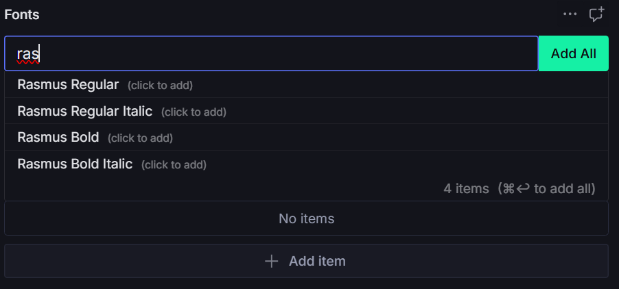
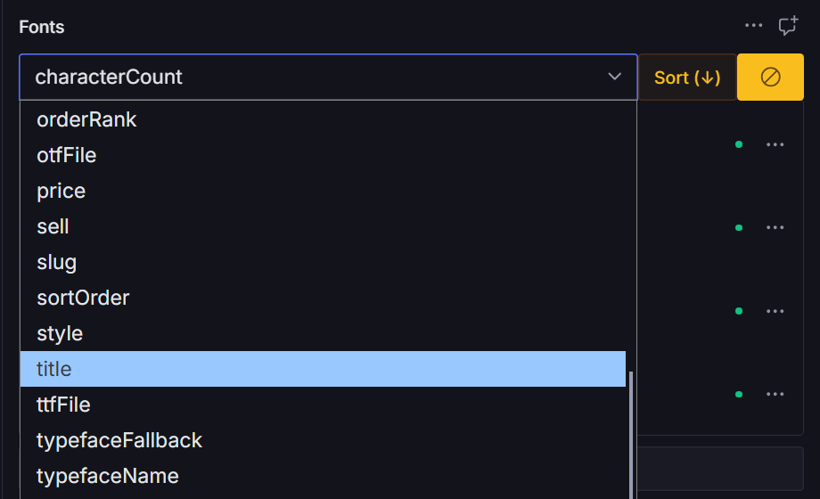
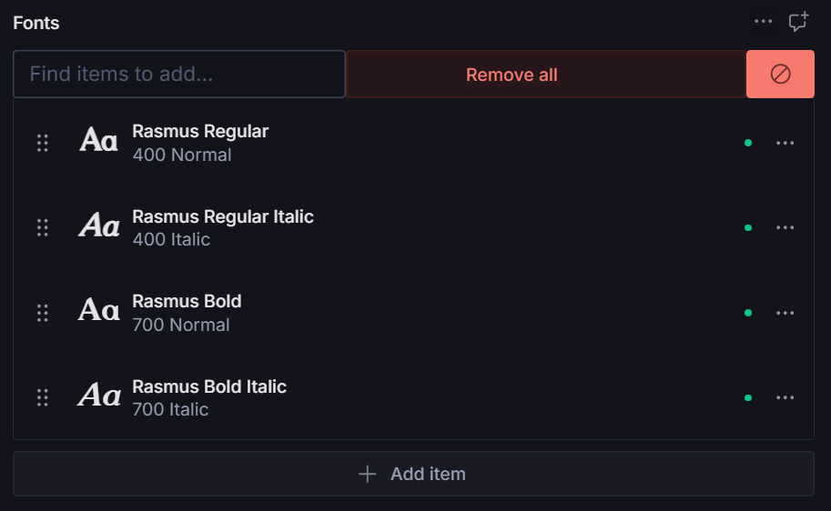

# Sanity Advanced Reference Array

🚀 **Enhanced reference array component for Sanity Studio with search, sort, and bulk operations**

A powerful, TypeScript-ready component that supercharges Sanity's reference arrays with advanced search capabilities, intelligent sorting, and intuitive bulk operations. Built from real-world usage in production Sanity studios.

## 🎥 **See It In Action**

https://github.com/user-attachments/assets/bb53e81b-4475-4510-bd86-452b954e3d2c

*Watch the Advanced Reference Array in action - featuring smart search, click-to-add functionality, bulk operations, and dynamic sorting.*

## ✨ Features

### 🔍 **Smart Search**



- **Live GROQ queries** with debounced search
- **Smart filtering** - automatically hides items already in your array
- **Individual click-to-add** - click any search result to add it instantly
- **Bulk "Add All"** - add multiple items at once
- **Keyboard shortcuts** - `Ctrl+Enter` to add all, `Escape` to clear search

### 🎯 **Dynamic Sorting**



- **Sort by any field** in your referenced documents
- **Visual sort indicators** - see if your list is already sorted
- **Toggle sort direction** - ascending/descending with one click
- **Browser compatible** - works across all modern browsers

### 🛡️ **Safety & UX**



- **Danger mode** - prevents accidental bulk deletions
- **Confirmation dialogs** for destructive operations
- **Loading states** and error handling
- **Responsive design** - works on mobile and desktop
- **Accessibility ready** - keyboard navigation support

### ⚡ **Performance**
- **Debounced search** - no unnecessary API calls
- **Smart caching** - efficient data fetching
- **TypeScript support** - full type safety
- **Tree-shakeable** - only import what you need

## 📦 Installation

```bash
npm install @liiift-studio/sanity-advanced-reference-array
```

## 🚀 Quick Start

```typescript
import { AdvancedRefArray } from '@liiift-studio/sanity-advanced-reference-array'

export default {
  name: 'myDocument',
  type: 'document',
  fields: [
    {
      name: 'relatedItems',
      type: 'array',
      of: [
        {
          type: 'reference',
          to: [
            { type: 'product' },
            { type: 'article' }
          ]
        }
      ],
      components: {
        input: AdvancedRefArray
      }
    }
  ]
}
```

## ⚙️ Configuration Options

```typescript
interface AdvancedRefArrayProps {
  // Core Sanity props (automatically provided)
  onChange: (patch: any) => void
  value?: Reference[]
  schemaType: SchemaType
  renderDefault: (props: any) => React.ReactNode
  
  // Enhanced configuration options
  searchFields?: string[]              // Fields to search in (default: ['title'])
  allowIndividualAdd?: boolean         // Enable click-to-add (default: true)
  allowBulkAdd?: boolean              // Enable "Add All" button (default: true)
  filterExisting?: boolean            // Hide already-added items (default: true)
  sortableFields?: string[]           // Fields available for sorting
  maxSearchResults?: number           // Max search results (default: 50)
  searchPlaceholder?: string          // Search input placeholder
  showItemCount?: boolean             // Show result counts (default: true)
  enableKeyboardShortcuts?: boolean   // Enable shortcuts (default: true)
}
```

## 🎨 Advanced Usage

### Custom Search Fields
```typescript
{
  name: 'products',
  type: 'array',
  of: [{ type: 'reference', to: [{ type: 'product' }] }],
  components: {
    input: AdvancedRefArray
  },
  options: {
    searchFields: ['title', 'description', 'sku'],
    maxSearchResults: 100,
    searchPlaceholder: 'Search products by name, description, or SKU...'
  }
}
```

### Disable Bulk Operations
```typescript
{
  name: 'featuredItems',
  type: 'array',
  of: [{ type: 'reference', to: [{ type: 'article' }] }],
  components: {
    input: AdvancedRefArray
  },
  options: {
    allowBulkAdd: false,           // Disable "Add All" button
    allowIndividualAdd: true,      // Keep individual click-to-add
    showItemCount: false           // Hide item counts
  }
}
```

### Custom Sorting
```typescript
{
  name: 'sortedArticles',
  type: 'array',
  of: [{ type: 'reference', to: [{ type: 'article' }] }],
  components: {
    input: AdvancedRefArray
  },
  options: {
    sortableFields: ['publishedAt', 'title', 'author'],
    enableKeyboardShortcuts: true
  }
}
```

## 🎯 Real-World Examples

### E-commerce Product Relations
```typescript
// Perfect for related products, cross-sells, upsells
{
  name: 'relatedProducts',
  title: 'Related Products',
  type: 'array',
  of: [{ type: 'reference', to: [{ type: 'product' }] }],
  components: { input: AdvancedRefArray },
  options: {
    searchFields: ['title', 'sku', 'category'],
    maxSearchResults: 20,
    searchPlaceholder: 'Search products...'
  }
}
```

### Content Collections
```typescript
// Great for curated article collections, featured content
{
  name: 'featuredArticles',
  title: 'Featured Articles',
  type: 'array',
  of: [{ type: 'reference', to: [{ type: 'article' }] }],
  components: { input: AdvancedRefArray },
  options: {
    sortableFields: ['publishedAt', 'title', 'readTime'],
    filterExisting: true,
    allowBulkAdd: false  // Curated content should be added individually
  }
}
```

### Team & Author Management
```typescript
// Perfect for assigning multiple team members, contributors
{
  name: 'contributors',
  title: 'Contributors',
  type: 'array',
  of: [{ type: 'reference', to: [{ type: 'person' }] }],
  components: { input: AdvancedRefArray },
  options: {
    searchFields: ['name', 'email', 'department'],
    sortableFields: ['name', 'role', 'joinDate'],
    searchPlaceholder: 'Search team members...'
  }
}
```

## 🔧 Development

```bash
# Clone the repository
git clone https://github.com/quitequinn/sanity-advanced-reference-array.git

# Install dependencies
npm install

# Build the package
npm run build

# Run type checking
npm run type-check

# Run linting
npm run lint
```

## 🤝 Contributing

We welcome contributions! This component was built from real-world usage across multiple Sanity studios and continues to evolve based on community needs.

### Areas for Contribution:
- 🐛 **Bug fixes** - Help us squash issues
- ✨ **Feature requests** - Suggest new capabilities
- 📚 **Documentation** - Improve examples and guides
- 🧪 **Testing** - Add test coverage
- 🎨 **UI/UX** - Enhance the user experience

## 📄 License

MIT © [Quinn Keaveney](https://github.com/quitequinn)

## 🙏 Acknowledgments

This component combines the best features from multiple implementations used in production Sanity studios:
- **Darden Studio** - Original advanced search and sort functionality
- **The Designer's Foundry** - Individual item selection and UX improvements
- **Community feedback** - Ongoing enhancements and bug fixes

## 🔗 Links

- [NPM Package](https://www.npmjs.com/package/@liiift-studio/sanity-advanced-reference-array)
- [GitHub Repository](https://github.com/quitequinn/sanity-advanced-reference-array)
- [Sanity.io](https://www.sanity.io/)
- [Report Issues](https://github.com/quitequinn/sanity-advanced-reference-array/issues)

---

**Made with ❤️ for the Sanity community**

*Transform your reference arrays from basic lists into powerful, searchable, sortable content management tools.*
